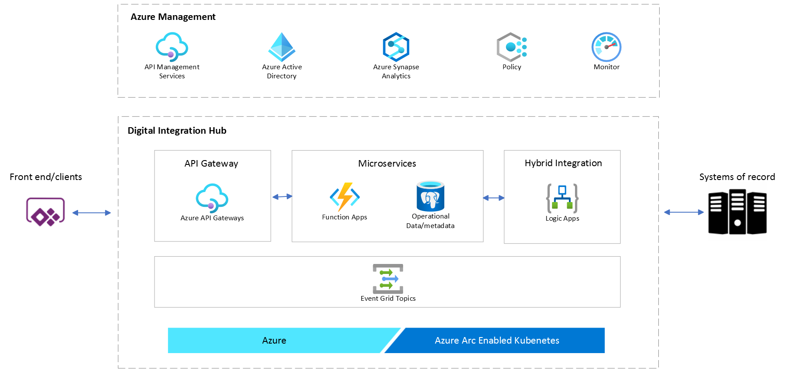

# Welcome to the Digital Integration Hub accelerator
This repository contains a template of an application built for the Azure Application Platform. This template is built to make it easy to dive straight into implementing business logic without having to spend time on setting up an engineering system for your application. The templates give you a starting point, while providing the option to change and extend any of the pre-configured components to suit your needs. 

This template provides you with the following components: A frontend API implemented by Azure Functions, a PostgreSQL database, an integration layer implemented by Azure Logic Apps and Event Grid and Monitoring provided by Application Insights and Log Analytics features of Azure Monitor.

## Template overview

The template provides:
- [A pre-configured development environment](/docs/concepts.md#development-environment)
- [An application](/docs/concepts.md#the-application)
- [Build and Deployment automation](/docs/concepts.md#build-and-deployment)

To get started using the template, we recommend following the [Quickstart](docs/quickstart.md).

For more information about the template, take a look at the [Concepts](docs/concepts.md) and [How-To Guides](docs/how-to-guides.md) docs as well.

**NOTE:** Check [below](#required-to-get-started) for required secrets and changes to get started

To get started, simply open the repository in Codespaces and start [debugging](.vscode/launch.json).
This is possible because the sample has a development environment [defined in a container (a .devcontainer)](.devcontainer). There are [database migration and seed data processes](src/function/db_migration) configured to run [when your devcontainer starts](.devcontainer/devcontainer.json), so expect some data to show up.

The function implements a simple CRUD based API. You can simply go ahead and add your business model and logic to the app.

Most of the routines you would want to run when developing are implemeted as [make targets](makefile), so simply invoke 'make build' to build the application, or use [VS Code tasks](.vscode/tasks.json). 

On checkins, the [app builds](.github/workflows/build.yaml) and a [Porter bundle](src/bundle) is being created and pushed to be consumed in the deploy stages. 

## Required to get started

1. Setup an ARC-enabled Kubernetes cluster, by following [these instructions](https://github.com/microsoft/Azure-App-Service-on-Azure-Arc/blob/main/docs/getting-started/setup.md). The [src/ARC/lima-setup.sh](src/ARC/lima-setup.sh) script can help, but check the setup instructions in the above link, as these change frequently.

1. Enable CNAB bundle support in GitHub
    1. Follow [this guide](https://docs.github.com/en/free-pro-team@latest/packages/guides/enabling-improved-container-support) to enable support for CNAB on GitHub

1. Set following deployment time parameters as GitHub secrets
    | Parameter | GitHub Secret | Description |
    | --- | --- | --- |
    | Package admin | `PACKAGE_ADMIN` | Create a [personal access token](https://docs.github.com/en/free-pro-team@latest/github/authenticating-to-github/creating-a-personal-access-token#creating-a-token) with 'write:packages' permissions and save the value to this secret |
    | Azure credentials | `AZURE_CREDENTIALS` | `az login -o none && az ad sp create-for-rbac --role contributor --sdk-auth` |
    | Postgres admin password | `POSTGRES_DB_ADMIN_PASSWORD` | Configure what postgres database admin password you want to use - [more info](https://docs.microsoft.com/en-us/azure/postgresql/concepts-security#access-management) by saving the password to a [GitHub Secrets](https://docs.github.com/en/free-pro-team@latest/actions/reference/encrypted-secrets#creating-encrypted-secrets-for-a-repository) name |

1. Check the environment.yaml file. For ARC deployments, ensure to include the correct App Service Environment to use. The syntax is commented in the file.

1. Run the build workflow, this will eventually kick-off the deployment workflow as well.
